# Mermaid
Mermaid is simple markdown-like script language for generating charts from text via javascript [^1]

## Syntax
```
TB/TD - top bottom
BT - bottom top
RL - right left
LR - left right
```

## Single Node

### Node
> A node is single a box/entity

```
graph LR
    id1
```

<div align="center">
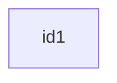
</div>

### Node with Title
```
graph LR
    id1[This is the text in the box]
```


<div align="center">
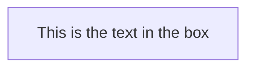
</div>

### Node with Round Borders
```
graph LR
    id1(This is the text in the box)
```

<div align="center">
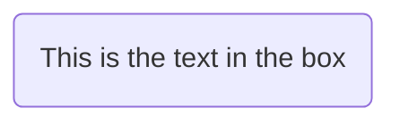
</div>


### Node with Circle
```
graph LR
    id1((This is the text in the circle))
```

<div align="center">
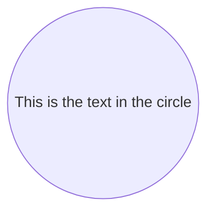
</div>


### Node with Asymmetric Shape
```
graph LR
    id1>This is the text in the box]
```

<div align="center">
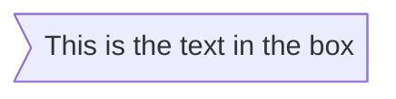
</div>

### Node with Rhombus
```
graph LR
    id1{This is the text in the box}
```

<div align="center">
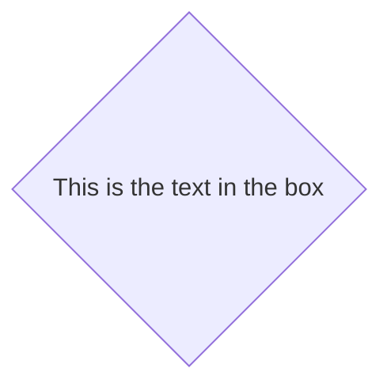
</div>

## Links Between Nodes

### Arrow Head
```
graph LR
  A-->B
```

<div align="center">

</div>

```
graph LR
  A---B
```

<div align="center">
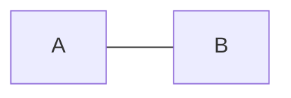
</div>

### Link with Text

```
graph LR
  A-- This is the text -->B
```

<div align="center">
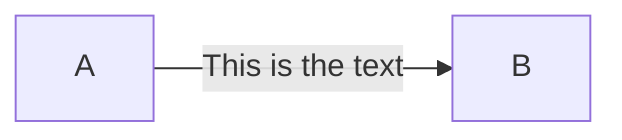
</div>


```
graph LR
  A-- This is the text ---B
```

<div align="center">
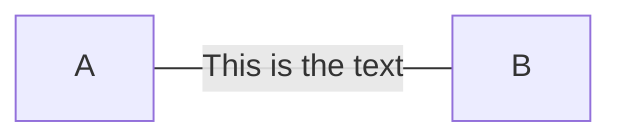
</div>

### Dotted Link

```
graph LR
  A-.-B
```


<div align="center">
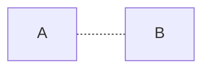
</div>

```
graph LR
  A-.->B
```


<div align="center">
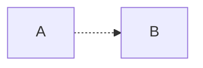
</div>


```
graph LR
  A-. This is the text .-B
```

<div align="center">
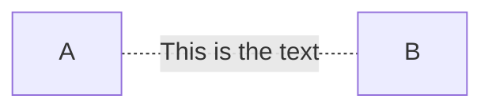
</div>

```
graph LR
  A-. This is the text .->B
```

<div align="center">
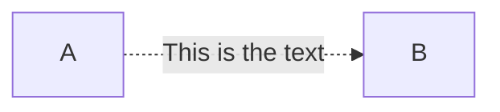
</div>


### Thick Link
```
graph LR
  A==>B
```

<div align="center">
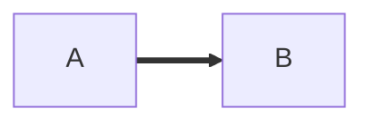
</div>

```
graph LR
  A===B
```

<div align="center">
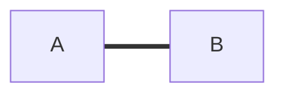
</div>

```
graph LR
  A== This is the text ===B
```

<div align="center">
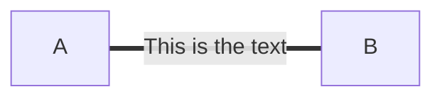
</div>

```
graph LR
  A== This is the text ==>B
```

<div align="center">
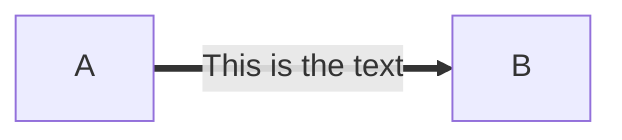
</div>


## Flowchart

### Top Down
```
graph TD
  A-->B
  A-->C
  B-->D
  C-->D
```

<div align="center">

</div>


### Left Right
```
graph LR
  A-->B
  A-->C
  B-->D
  C-->D
```

<div align="center">
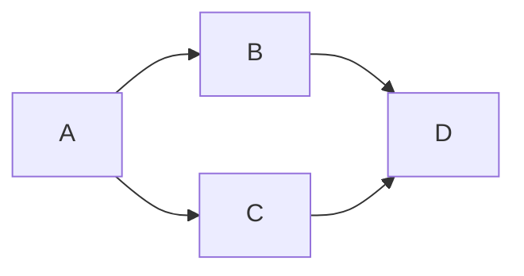
</div>


### Special Characters
```
graph LR
  A["A double quote:#quot;"] -->B["A dec char:#9829;"]
```

<div align="center">
```mermaid
graph LR
      A["A double quote:#quot;"] -->B["A dec char:#9829;"]
```
</div>


### Link
```
graph LR;
  A-->B;
  click A callback "Tooltip for a callback"
  click B "http://www.github.com" "This is a tooltip for a link"
```

<div align="center">
```mermaid
graph LR;
  A-->B;
  click A callback "Tooltip for a callback"
  click B "http://www.github.com" "This is a tooltip for a link"
```
</div>


### Font Awesome
```
graph TD
  B["fa:fa-twitter for peace"]    
  B-->C[fa:fa-ban forbidden]
  B-->D(fa:fa-spinner)
  B-->E(A fa:fa-camera-retro perhaps?)
```

<div align="center">
```mermaid
graph TD    
  B["fa:fa-twitter for peace"]
  B-->C[fa:fa-ban forbidden]
  B-->D(fa:fa-spinner);
  B-->E(A fa:fa-camera-retro perhaps?);
```
</div>

<br>
<br>

### Basic Flowchart
```
graph LR
  A[Square Rect] -- Link text --> B((Circle))
  A --> C(Round Rect)
  B --> D{Rhombus}
  C --> D
```

<div align="center">
```mermaid
graph LR
  A[Square Rect] -- Link text --> B((Circle))
  A --> C(Round Rect)
  B --> D{Rhombus}
  C --> D
```
</div>


## Sequence Diagram

### Syntax
```
-> a solid line without arrow
--> a dotted line without arrow
->> a solid line with arrowhead
-->> a dotted line with arrowhead
-x a solid line with a cross at the end (async)
--x a dotted line with a cross at the end (async)
```

### Generation
```
sequenceDiagram
  participant John
  participant Alice
  Alice->>John: Hello John, how are you?
  John-->>Alice: Great!
```


<div align="center">
```mermaid
sequenceDiagram
  participant John
  participant Alice
  Alice->>John: Hello John, how are you?
  John-->>Alice: Great!
```
</div>


#### Reference
[^1]: Github: https://github.com/knsv/mermaid
[^2]: Mermaid Reference: http://knsv.github.io/mermaid/#mermaid
[^3]: Gitbook Mermaid Plugin: https://plugins.gitbook.com/plugin/mermaid-gb3
