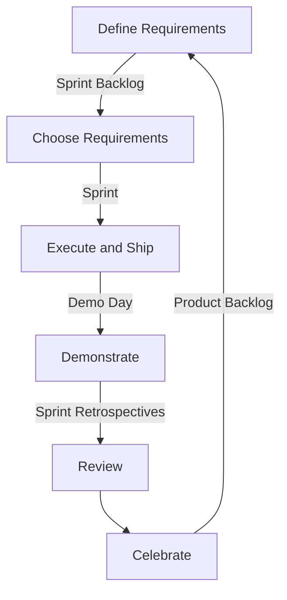

# Agile Development with Scrum
 When a group of developers work on a single project, effective communication and collaboration play big roles. Agile development is one method to accomplish the need. In a nutshell, it allows a team/teams to add small features and ship the product. The development process lasts 1 week to 4 weeks. The cycle repeats until the team meets the requirements.

## Definition
| Terms | Definition |
| --- | --- |
| Agile |  A group of software development methodologies based on iterative development, where requirements and solutions evolve through collaboration between self-organizing cross-functional teams.
| Scrum | One of agile development methodologies |
| Product Backlog | An ordered list of requirements that for a product. It consists of features, bug fixes, non-functional requirements. The Product Owner (clients, CEO) orders the Product Backlog Items (PBIs) based on considerations such as risk, business value, dependencies, and date needed. |
| Sprint | 1 week to 1 month of period to execute requirements |
| Sprint Backlog | The Sprint Backlog is the list of work the Development Team must address during the next Sprint. |
| Product Inclement | The sum of all the Product Backlog Items completed during a Sprint, integrated with the work of all previous Sprints. At the end of a Sprint, the increment must be complete, according to the Scrum Team's definition of done (DoD), fully functioning, and in a usable condition regardless of whether the client decides to actually release it. |

## The Agile Manifesto Definition
Agile software development methodologies follow a set of ground principles created by leading software engineers.
 - Continuous Delivery
 - Welcome changing requirements
 - Deliver working software frequently
 - Involve business and developers throughout the project
 - Build projects around motivated folks
 - Communication should be face-to-face
 - Primary metric of progress is working software
 - All participants should maintain a constant pace
 - Continuous attention to tech excellence & good design
 - Simplicity is essential
 - Self organizing teams
 - Periodic retrospectives

## Organization
There are three roles defined in Scrum: the ScrumMaster, the Product Owner, and the Team. Every role work together closely on a daily basis.

### The Team
The Team is a self-organizing and cross-functional group of people who do the hands-on work of developing and testing the product. Since the Team is responsible for producing the product, it must also have the authority to make decisions about how to perform the work. The Team is therefore self-organizing: Team members decide how to break work into tasks, and how to allocate tasks to individuals, throughout the Sprint. The Team size should be kept in the range from five to nine people

### The Scrum Master
 - Remove the barriers between the development Team and the Product Owner so that the Product Owner directly drives development.
 - Teach the Product Owner how to maximize return on investment (ROI), and meet his/her objectives through Scrum.
 - Improve the lives of the development Team by facilitating creativity and empowerment.
 - Improve the productivity of the development Team in any way possible.
 - Improve the engineering practices and tools so that each increment of functionality is potentially shippable.
 - Keep information about the Team’s progress up to date and visible to all parties.
 -  The Scrum Master is not a traditional team lead or project manager
 - Acts as a buffer between the team and any distracting influences.
 - Ensures that the Scrum framework is followed.
 - The role has also been referred to as a team facilitator or servant-leader to reinforce these dual perspectives.

### Product Owner
 The Product Owner is the keeper of the requirements. He provides the “single source of truth” for the Team regarding requirements and their planned order of implementation. The Product Owner represents the product's stakeholders and the voice of the customer; and is accountable for ensuring that the team delivers value to the business. The Product Owner writes customer-centric items (typically user stories), prioritizes them based on importance and dependencies, and adds them to the Product Backlog. Scrum Teams should have one Product Owner. This role should not be combined with that of the Scrum Master.

 As the face of the team to the stakeholders, the following are some of the communication tasks of the Product Owner to the stakeholders

 - The Product Owner demonstrates the solution to key stakeholders who were not present at a Sprint Review.
 - The Product Owner defines and announces releases
 - The Product Owner communicates team status
 - The Product Owner organizes milestone reviews
 - The Product Owner educates stakeholders in the development process
 - The Product Owner negotiates priorities, scope, funding, and schedule
 - The Product Owner ensures that the Product Backlog is visible, transparent, and clear.

## Overall Scrum Process
 1. Determine product backlogs based on priority
 2. Determine which backlogs to complete for a sprint
 3. Modularize the selected backlogs into tasks. Each task should require 2-3 hours to complete .
 4. During the sprint, run a daily meeting at the same time and location that last 10-15 minutes
 5. When the sprint is over, have a review meeting and demo day.
 6. Prepare for next sprints

### User Story
Scrum does not define just what form requirements are to take, but simply says that they are gathered into the Product Backlog, and referred to generically as “Product Backlog Items,” or “PBIs” for short. Given the time-boxed nature of a Sprint, we can also infer that each set should require significantly less time to implement than the duration of the Sprint

A User Story describes a desired feature (functional requirement) in narrative form. User Stories are usually written by the Product Owner, and are the Product Owner’s responsibility.

Name: Planner enters new contact into address book, so that he can contact the person later by postal or electronic mail

Description: Planner enters standard contact information (first and last name, two street address lines, city, state, zip / postal code, country, etc.) into contact-entry screen. He clicks “Save” to keep the data, and “Cancel” to discard data and return to previous screen.

How to test: Tester enters and saves the data, finds the name in the address book, and clicks on it. He sees a read-only view of the contact-entry screen, with all data previously entered.

### Create a list of backlog items

| ID | Name | Priority | Days | Demo | Notes |
| --- | --- | --- | --- | --- |--- |
| 1 | Transfer Money | 30 | 5 | LogIn, page, $10 | No need to care about passwords |
| 2 | Balance sheet | 10 | 5 | Withdraw page | The balance sheet has to look pretty |

> Days = number of days x developer(s) and every backlog item must have a leader.

### Daily Scrum
Go through three following questions
 - What did I do yesterday that helped the Development Team meet the Sprint goal?
 - What will I do today to help the Development Team meet the Sprint goal?
 - Do I see any impediment that prevents me or the Development Team from meeting the Sprint goal?

Any impediment (e.g., stumbling block, risk, issue, delayed dependency, assumption proved unfounded) identified in the Daily Scrum should be captured by the Scrum Master and displayed on the team's Scrum board or on a shared resolved, owned, accepted, mitigated (ROAM) board, with an agreed person designated to working toward a resolution (outside of the Daily Scrum). No detailed discussions should happen during the Daily Scrum.

### Foundation
These three pillars require trust and openness in the team, which the following five values of Scrum enable:

 - **Commitment**: Team members individually commit to achieving their team goals, each and every Sprint.
 - **Courage**: Team members know they have the courage to work through conflict and challenges together so that they can do the right thing.
 - **Focus**: Team members focus exclusively on their team goals and the Sprint Backlog; there should be no work done other than through their backlog.
 - **Openness**: Team members and their stakeholders agree to be transparent about their work and any challenges they face.
 - **Respect**: Team members respect each other to be technically capable and to work with good intent.

### Sprint Meeting
This is the most important event in the process. These are following outcomes:
 - One sprint purpose
 - sprint backlog
 - demo day
 - Daily meet up time and place
 - product owner must attend

The scrum methodology always has a strict time line.

| Time | Tasks |
| --- | --- |
| 13:00 - 13:30 | The product owner reviews the purpose, product backlog, demo, and date. |
| 13:40 - 15:00 | The team determines approximate time. If needed, the backlog is modularized and organized |
| 15:10 - 16:00 | The team chooses product backlog items |
| 16:10 - 17:00 | Choose time and place for daily standup.  Modularize the selected stories |

### Demo Day
Every sprint must end up with a demo day. Here is a list of reasons,
 - Team may feel good for the achievement
 - The team knows which tasks they have implemented
 - Feedbacks generated from the feature
 - Demo instills new conversations and ideas.

### Demo Day Tips
 - Check if the demo aligns with the sprint purpose
 - Don't spend too much time on demo. No need to be fancy.
 -  Demo must be business oriented. Instead of how you did, focus on what you did.
 - You may mention small bugs, but do not point out aggressively.

### Sprint Retrospectives
Sprint reflection is a must since it allows the team to improve and share honest thoughts and feelings during the process.

Two main questions are asked in the Sprint Retrospective: What went well during the Sprint? What could be improved in the next Sprint?
The recommended duration is one-and-a-half hours for a two-week Sprint (pro-rata for other Sprint durations)
This event is facilitated by the Scrum Master

 - It should last 1-3 hours.
 - The team lead and team members join
 - Hold the meeting somewhere casual and loose
 - The team lead reflects upon the dashboard
 - Check the predicted hours versus the hours actually spent. Ask why.
 - The team lead suggests or asks how can the team improve the development process

### Rest between Sprints
You can't always "sprint". Going through Scrum reflection and planning is the worst. You should take your team to restaurants, and relax.

## Benefits of Scrum
| Beneficiary | Benefits |
| --- | --- |
| Customers | Customers find that the vendor is more responsive to development requests. High-value features are developed and delivered more quickly with short cycles, than with the longer cycles favored by classic “waterfall” processes. |
| Vendors | Vendors reduce wastage by focusing development effort on high-value features, and reduce time-to-market relative to waterfall processes due to decreased overhead and increased efficiency. Improved customer satisfaction translates to better customer retention and more positive customer references. |
| Development Teams | Team members enjoy development work, and like to see their work used and valued. Scrum benefits Team members by reducing non-productive work (e.g., writing specifications or other artifacts that no one uses), and giving them more time to do the work they enjoy. Team members also know their work is valued, because requirements are chosen to maximize value to customers. |
| Product Managers | Product Managers, who typically fill the Product Owner role, are responsible for making customers happy by ensuring that development work is aligned with customer needs. Scrum makes this alignment easier by providing frequent opportunities to re-prioritize work, to ensure maximum delivery of value. |
| PMOs and C-Executives | Scrum provides high visibility into the state of a development project, on a daily basis. External stakeholders, such as C-Level executives and personnel in the Project Management Office, can use this visibility to plan more affectively, and adjust their strategies based on more hard information and less speculation. |

### Overall

### Book
[Essential Scrum: A Practical Guide to the Most Popular Agile Process](http://amzn.to/2mOGS7u)

[Scrum: The Art of Doing Twice the Work in Half the Time](http://amzn.to/2n6a4bU)

#### Reference
[scrummethodology.com](http://scrummethodology.com/)

[What is Agile? What is Scrum?](https://www.cprime.com/resources/what-is-agile-what-is-scrum/)
